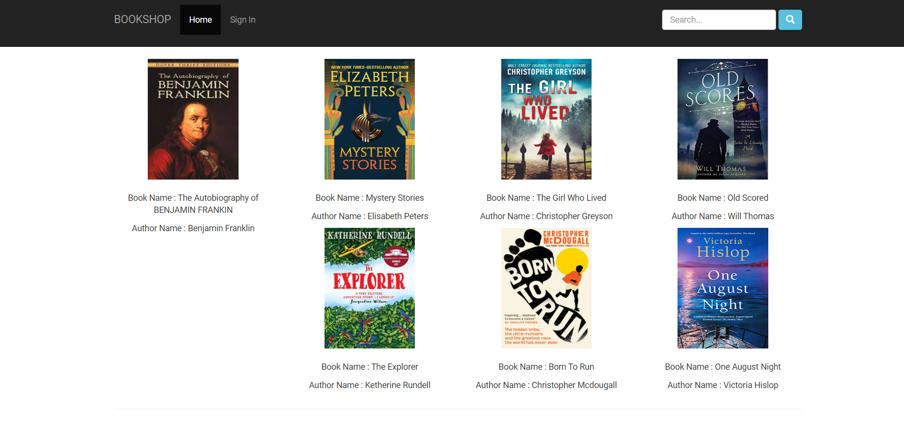
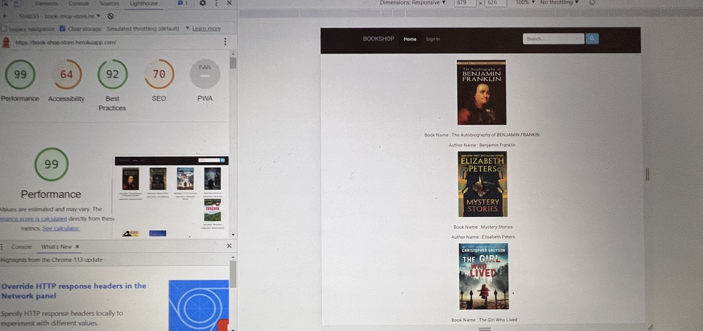
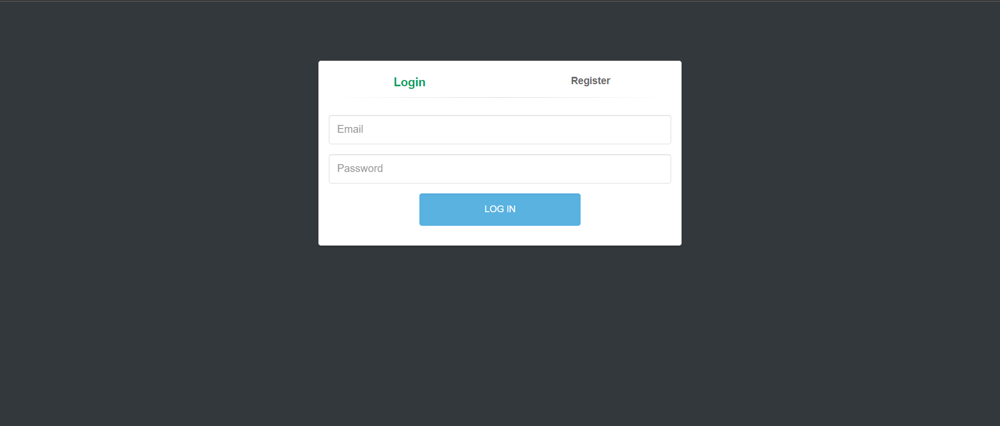
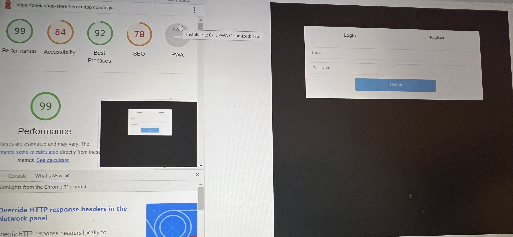
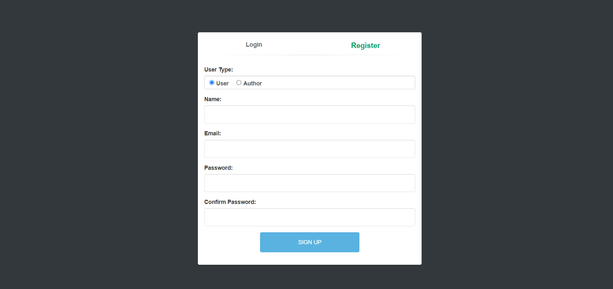
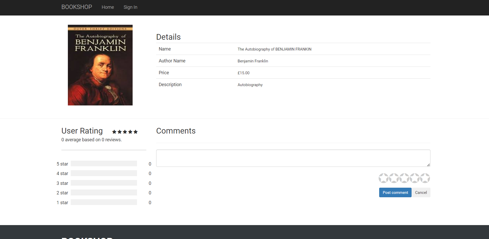

# Book Shop Flask Application

%20(2).png)

Welcome to the Book Shop Flask App! This application is designed to help users manage their Books shop and add books, from the admin side and user can buy the book online by user rating and reviews.

## Table of Contents
* [Purpose](#purpose)
* [User Experience](#user-Experience)
    * [User Stories](#user-Stories)
    * [Design](#design)
        * [Color Scheme](#color-Scheme)
        * [Typography](#typography)
        * [Imagery](#imagery)
        * [Wireframes](#wireframes)
    * [Features](#features)
    * [Accessibility](#accessibility)
* [Technologies Used](#technologies-Used)
    * [Languages Used](#languages-Used)
    * [Frameworks and Libraries Used](#frameworks-and-Libraries-Used)
* [Testing](#testing)
    * [Validation](#validation)
    * [Fixed Bugs](#fixed-Bugs)
    * [Known Issues](#known-Issues)
    * [Testing User Stories](#Testing-User-Stories)
    * [Lighthouse](#Lighthouse)
        * [Home Page](#Home-Page)
        * [ Login Page](#Login-Page)
        * [Register Page](#Register)
    * [Manual Testing](#Manual-Testing)
* [Deployment & Local Development](#Deployment-&-Local-Development)
    * [Deploying to Heroku](#Deploying-to-Heroku)
    * [Local Development](#Local-Development)
        * [How to Fork](#How-to-Fork)

## Purpose
This is a Flask web application for managing books and buy the books by viewing review and rating of the books . The app allows members to create accounts, view the books availabe in the app and check the honest user review with star ratings from 1 to 5 stars

- Admin can add new books and manage the review and edit the book poster and price as per the demand

## User Experience
## User Stories
- First Time Visitor Goals
    - As a first time visitor, I want to be able to navigate the site easily.
    - As a first time visitor, I want to sign up and create a new account.
    - As a first time visitor, I want to view the available books and check the ratings and customer feedback about books.
- Returning Visitor Goals
    - As a returning visitor, I want to log in to my account.
    - As a returning visitor, I want to buy more books and read more

## Design
The project's documentation describes the UX design work undertaken for this project and the reasoning behind it.

The UX design was focused on creating an intuitive and user-friendly experience for Admin as well as the customer who are here to buy the books The app features a clean and modern design that is easy to navigate, with clear calls to action and a consistent layout throughout.

The user interface was designed to be responsive and mobile-friendly, with a layout that adapts to different screen sizes and resolutions. This allows customer to easily check for the available books by searching for the particular books

Overall, the UX design was informed by user research and feedback, with a focus on creating a user-friendly and engaging experience for customers and admin.

- `Color Scheme` - The color scheme for this application is Grey, white and Blue.

- `Typography` -
The primary font used in this application is Open Sans.

- `Imagery` -
Images used in this application are primarily related to books and the posters.

- `Wireframes` -
Wireframes for this application are available upon request.
## Features

- User authentication: Customer can create accounts and log in to check their books availability.
- Adding new books: Admin can add books with poster and frontpage with it and can post for the customer .
- Progress monitoring: Members can view their workout history and monitor their progress over time.
- Customer : can can view the books details and check for the honest reivew and rating of the customer who have already buy and read the books
- Statistics tracking: Curomer can view statistics such as review rating and stars of the book in global market

## Accessibility
This application has been designed with accessibility in mind, and includes appropriate labeling and alt text for images.

## Technologies Used
 - Languages Used
    * Python
    * HTML
    * CSS
    * JavaScript
 - Frameworks and Libraries Used
    * Flask
    * Bootstrap
## Testing
 - `Validation` -
This application has been validated using the W3C Markup Validation Service.

## Fixed Bugs
* No major bugs were encountered during development.

## Known Issues
* No known issues exist at this time.

## Testing User Stories
All user stories have been tested and validated.

## Lighthouse
-Index Page


- Login/Registration Page



.JPG)



## Deployment & Local Development
* `Deploying to Heroku`
- Create a Heroku account: First, create a free account on Heroku's website.

- Install Heroku CLI: Install Heroku CLI on your local machine, which can be done by following the instructions provided on Heroku's website.

- Create a new Heroku app: Log in to your Heroku account and create a new app by clicking on the "New" button and selecting "Create new app".

- Set up PostgreSQL: Add the Heroku Postgres add-on to your app. You can do this by clicking on the "Resources" tab in your app dashboard, then searching for and selecting "Heroku Postgres" in the "Add-ons" section.

- Configure Flask settings: Update your Flask settings.py file to use the environment variable for the database connection.

- Create a requirements.txt file: Create a requirements.txt file that lists all the required packages and dependencies for your Flask project.

- Create a Procfile: Create a Procfile in the root directory of your project and define the command to run your Flask app.

- Push your code to Heroku: Use Git to push your code to Heroku. You can do this by running the following commands in your terminal:
```sh
    $ heroku login
    $ heroku git:remote -a your-app-name
    $ git add .
    $ git commit -am "Initial commit"
    $ git push heroku master
```
- Migrate the database: Run the following command to apply any database migrations to the Heroku Postgres database:
```sh
    $ heroku run python app.py
```
- Launch the app: Finally, launch your app on Heroku by running the following command:
```sh
    $ heroku ps:scale web=1
```
# Local Development
## How to Fork
To install and run the app locally, follow these steps:

- Clone the repository to your local machine.
Install the required packages using` pip install -r requirements.txt`.
- Create a PostgreSQL database and configure the database settings.
- Run `Flask run` to start the development server.

